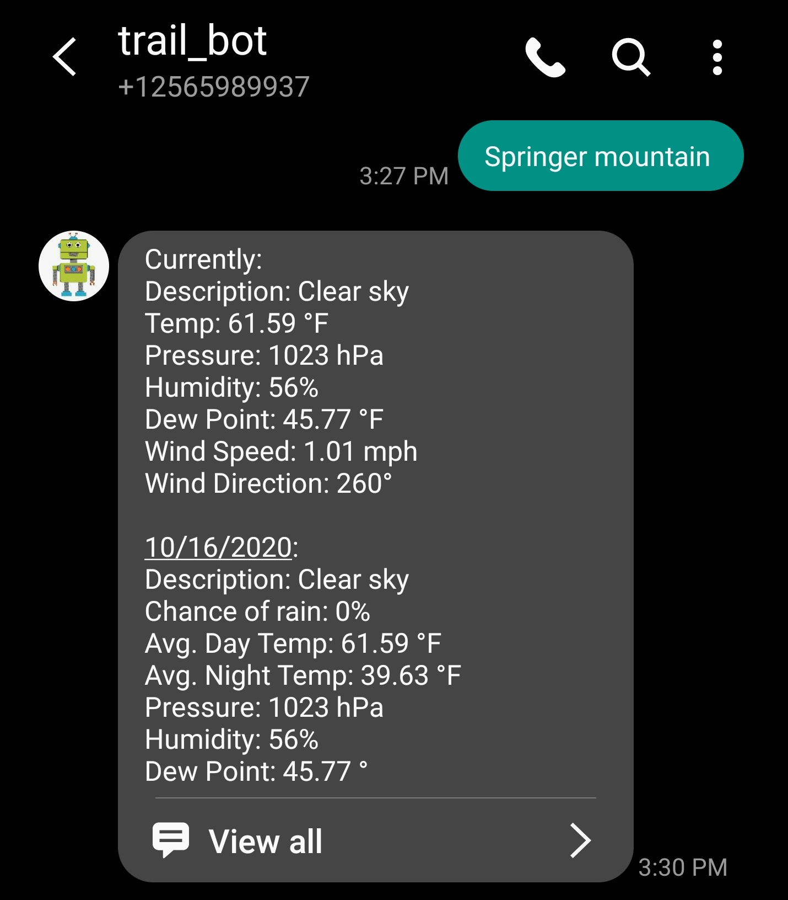
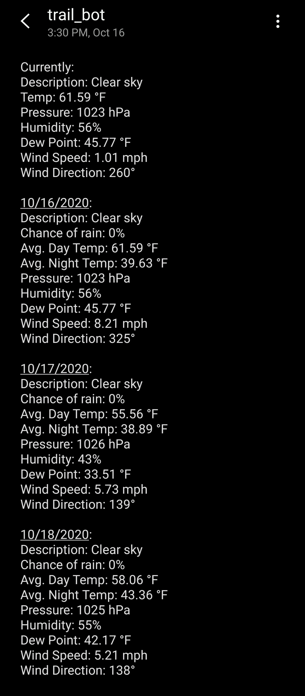

# trail_bot

## :thought_balloon: Background 
Appalachian hikers often find themselves in need of weather data at locations with no access to internet. This application allows hikers to recieve the information they require using their mobile network connection rather than the internet.
When a SMS message containing the name of a trail-shelter is sent to trail_bot it responds with the current weather data, and a three-day forecast at the shelters location. 

## :wrench: Progress

## :bulb: Work to be done
* Push to Heroku so that access is open to everybody
* Add any missing shelters to database
